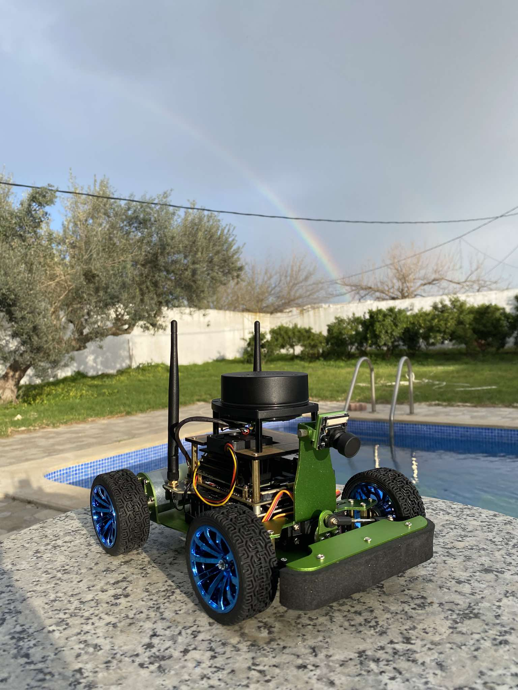

# 🤖 RobotWise — Application interactive avec robot  JetRacer

**RobotWise** est une application tablette immersive qui permet à un enfant trisomique d’interagir en temps réel avec un robot physique, **JetRacer**,  Il peut dessiner, lire des histoires générées par IA, contrôler un robot, explorer l’environnement .

> ⚠️ **Remarque** : Le code source  est privé. Ce fichier README.md fournit un aperçu du projet et de ses fonctionnalités.
---

## 🎯 Objectifs

- Stimuler la **créativité** et l’imaginaire des enfants à besoins spécifiques.
- Introduire des **interactions robotiques concrètes et ludiques**.
- Développer la confiance, les compétences motrices et l’autonomie.
- Valoriser chaque progrès dans un **environnement éducatif personnalisé**.

---

## ✨ Fonctionnalités principales

- 🎮 **Contrôle du robot JetRacer** à distance via une interface Flutter.
- 🎨 **Activité de dessin libre**, validée en temps réel par un agent AI via LiveKit.
- 📖 **Storytelling généré par IA** :
  - Génération de l’histoire par **Gemini 2.0 Flash** (texte + images adaptées).
  - Diffusion par stream API (chunking) + narration vocale avec **Speechify**.
- 🧭 **Mode “Explore”** où l’enfant guide le robot pour découvrir des objets réels.
- 🧠 Synchronisation du **progrès et des talents détectés** avec l’écosystème global.

---

## 🧠 Intelligence Artificielle embarquée

| Composant           | Rôle                                                                 |
|---------------------|----------------------------------------------------------------------|
| **LiveKit AI Agent**| Valide les dessins et comportements de l’enfant en temps réel via WebRTC |
| **Gemini 2.0 Flash**| Génère dynamiquement des histoires adaptées + images correspondantes |
| **Speechify TTS**   | Convertit les histoires en voix naturelle                            |

---

## 📱 Technologies utilisées

| Technologie        | Usage                                                                 |
|--------------------|-----------------------------------------------------------------------|
| **Flutter**         | App tablette avec UI adaptée à l’enfant                              |
| **NestJS**          | Backend sécurisé pour la communication et l’authentification         |
| **LiveKit**         | Traitement temps réel des entrées audio/vidéo pour validation IA     |
| **JetRacer (Jetson)**| Robot éducatif connecté à l’application                             |
| **Streaming API**   | Transmission de contenu narratif en morceaux (chunked)               |

---

